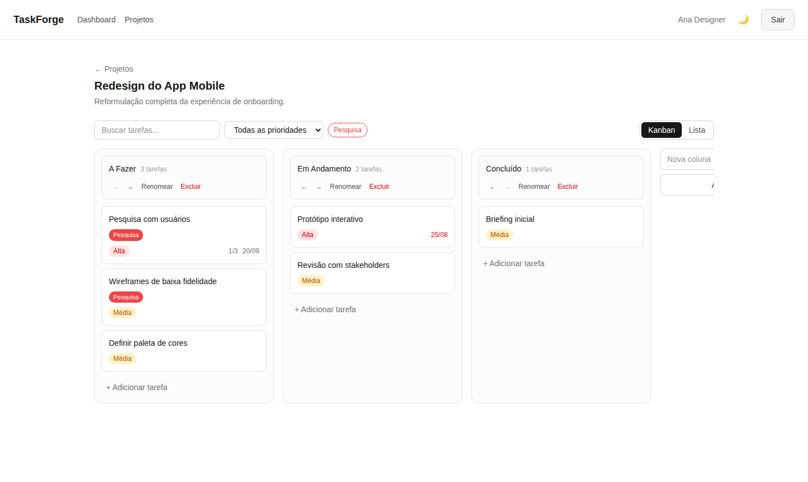
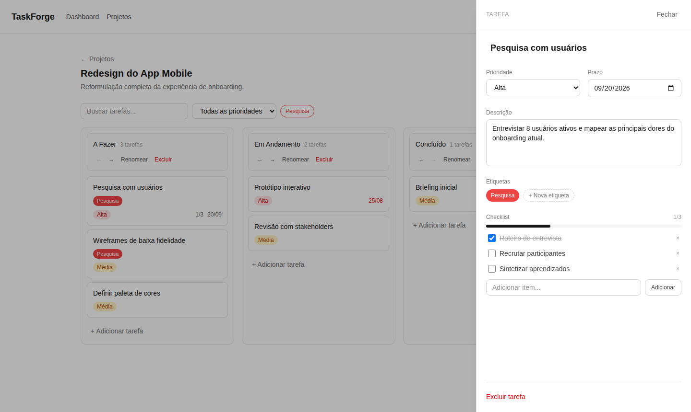
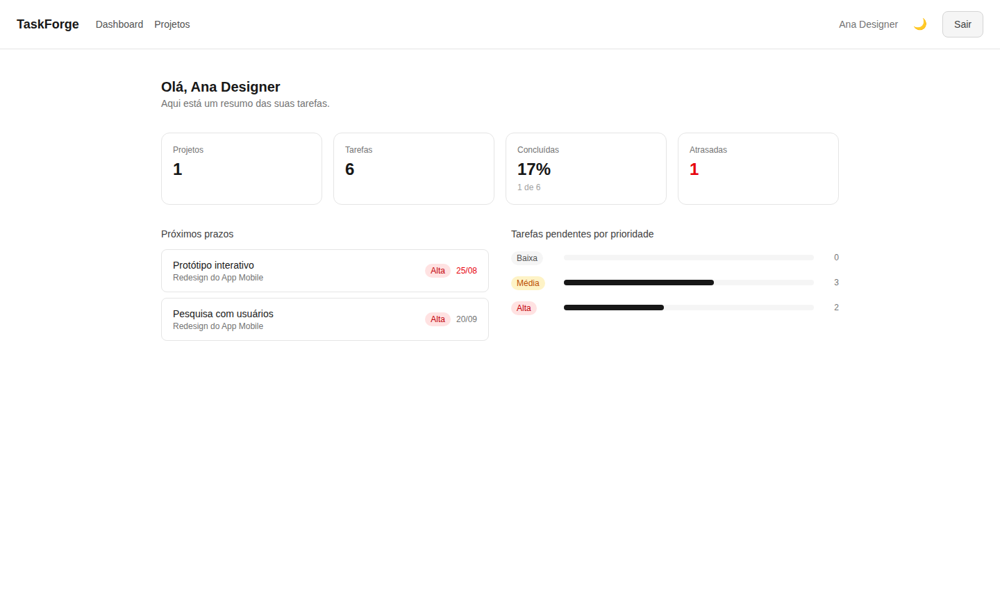
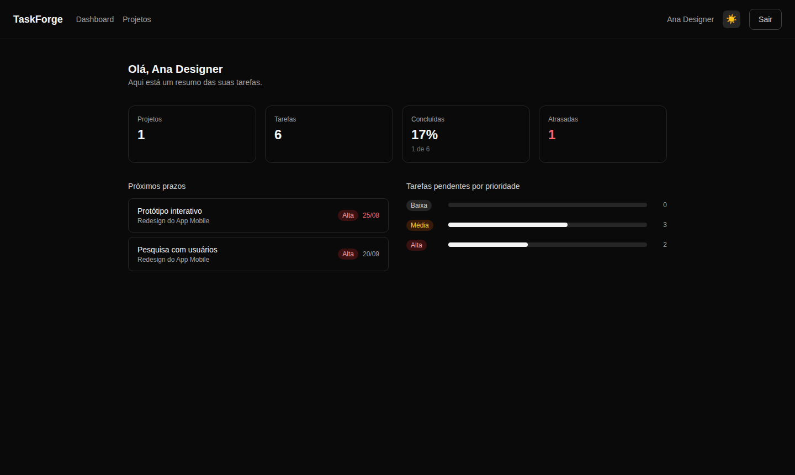

# TaskForge

Gerenciador de tarefas estilo Kanban — full stack, com autenticação, banco de dados real, drag & drop e dark mode.



## Funcionalidades

- **Contas de usuário** — cadastro e login com e-mail/senha
- **Projetos/boards** — criar, editar, excluir
- **Colunas personalizáveis** — criar, renomear, excluir, reordenar
- **Kanban com drag & drop** — mover tarefas entre colunas e reordenar dentro delas
- **Tarefas completas** — título, descrição, prioridade, prazo e etiquetas coloridas
- **Checklist/subtarefas** com indicador de progresso
- **Painel lateral** para visualizar e editar uma tarefa, com autosave por campo
- **Busca e filtros** — por título, prioridade e etiquetas
- **Duas visualizações** — Kanban e Lista
- **Dashboard** com resumo das tarefas (concluídas, atrasadas, próximos prazos, distribuição por prioridade)
- **Dark mode / Light mode**
- **Totalmente responsivo** — desktop e celular
- **Estados de loading, erro e vazio** em todas as telas principais

## Capturas de tela

| Painel de tarefa | Dashboard |
| --- | --- |
|  |  |

<details>
<summary>Dark mode</summary>



</details>

## Stack

- [Next.js](https://nextjs.org) (App Router) + TypeScript
- [Tailwind CSS](https://tailwindcss.com)
- [PostgreSQL](https://www.postgresql.org) + [Prisma](https://www.prisma.io) (com driver adapter `@prisma/adapter-pg`)
- [Auth.js / NextAuth v5](https://authjs.dev) — Credentials Provider, sessão via JWT
- [dnd-kit](https://dndkit.com) — drag & drop do Kanban
- [next-themes](https://github.com/pacocoursey/next-themes) — dark mode
- [Zod](https://zod.dev) — validação de formulários

## Algumas decisões técnicas

- **A coluna é o status da tarefa.** Em vez de um campo `status` separado (que poderia ficar dessincronizado da coluna), a posição da tarefa no Kanban é a única fonte da verdade. O mesmo critério é reaproveitado no dashboard: uma tarefa conta como concluída quando está na última coluna do projeto.
- **Server Actions em vez de uma API REST separada.** Todas as mutações (criar projeto, mover tarefa, etc.) são Server Actions do Next.js — menos código de "cola" do que manter rotas de API à parte, com verificação de propriedade (ownership) em cada uma delas.
- **Atualização otimista onde importa.** Mover uma tarefa no Kanban e marcar um item do checklist respondem instantaneamente na tela (via `useOptimistic`), sem esperar a confirmação do servidor — mas o cálculo da posição real da tarefa sempre usa a lista completa (não filtrada), então buscar/filtrar nunca corrompe a ordenação por trás.
- **Autenticação sem tabelas extras.** Como o login é só por e-mail/senha (sem OAuth), a sessão usa JWT em vez do adapter de banco do NextAuth — dispensa as tabelas `Account`/`Session`/`VerificationToken`.

## Rodando localmente

1. Suba o banco de dados com Docker:

   ```bash
   docker compose up -d
   ```

2. Copie o arquivo de variáveis de ambiente:

   ```bash
   cp .env.example .env
   ```

   Gere um valor para `AUTH_SECRET` e substitua no `.env`:

   ```bash
   openssl rand -base64 32
   ```

3. Instale as dependências:

   ```bash
   npm install
   ```

4. Gere o Prisma Client e aplique as migrations no banco:

   ```bash
   npx prisma generate
   npx prisma migrate deploy
   ```

5. Rode o servidor de desenvolvimento:

   ```bash
   npm run dev
   ```

6. Abra [http://localhost:3000](http://localhost:3000).

## Estrutura do projeto

```
src/
├─ app/
│  ├─ (app)/              # área autenticada (dashboard, projetos, board)
│  ├─ login/ register/    # autenticação
│  └─ api/                # rotas do NextAuth e de registro
├─ lib/
│  ├─ actions/             # Server Actions (projetos, colunas, tarefas, subtarefas, etiquetas)
│  └─ validations/         # schemas Zod
├─ components/             # componentes de UI compartilhados
├─ auth.ts / auth.config.ts # configuração do NextAuth
└─ generated/prisma/        # Prisma Client gerado (não versionado)
prisma/
├─ schema.prisma
└─ migrations/
```

## Sobre este projeto

Este projeto foi construído, em grande parte, com o auxílio do **Claude** (Anthropic). Usei o desenvolvimento do TaskForge para me aprofundar no Claude Code e dominar a ferramenta como parte do meu fluxo de trabalho — sem deixar de lado minhas próprias habilidades técnicas e raciocínio, que guiaram cada decisão de arquitetura, revisão de código e critério de qualidade do produto final.
